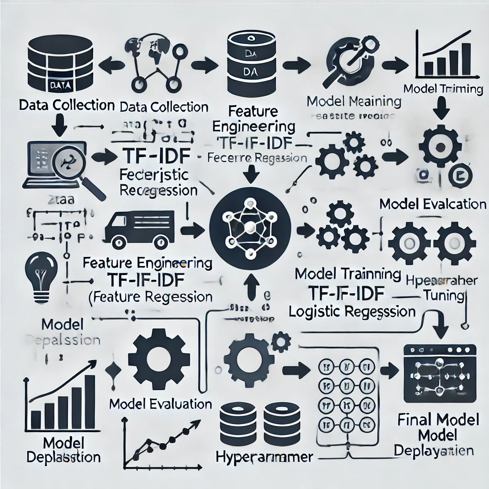

# 🏆 Hackathon Project - Datathon 2025


## 📌 Problem Statement

Participants were given three datasets: train, test, and labels. The goal was to:

Predict item accuracy for a store.

Generate a complete, correctly formatted data file as required by the organizers.

Maximize accuracy while adhering to constraints like model training time and kernel stability.

The challenge wasn’t just building a model — it was about handling data efficiently, iterating rapidly, and overcoming system limitations.

## Folder structure:

```
├── datasets/
│   ├── train.csv
│   ├── test.csv
│   └── labels.csv
├── notebooks/
│   ├── datathonr2starter.ipynb
│   ├── model_training.ipynb
│   └── workingnotebook.ipynb
├── models/
│   └── final_model.pkl
├── Submissions/
│   └── submission.csv
├── requirements.txt
└── README.md

```
 

## 🚀 Our Solution

We built a machine learning pipeline that tackled the problem through multiple iterations, gradually improving accuracy and system performance.

**Model Architecture & Approach:**



**Initial Experiments:**

🫴 Started with a basic model yielding 0.45 accuracy.

🫴 Refined with feature engineering, boosting accuracy to 0.54.

**Core ML Techniques:**

🫴 Tested various algorithms (Random Forest, XGBoost, etc.).

🫴 Eventually settled on a combination of TF-IDF Vectorization and Logistic Regression, achieving a peak accuracy of 0.79%.

**Optimization & Stability:**

🫴 Reduced training time to 2.86 minutes.

🫴 Debugged kernel crashes and optimized memory usage to ensure model stability during final submissions.

**Continuous Iteration:**

🫴 Persistent testing and failure analysis.

🫴 Balanced accuracy and runtime to meet competition constraints.

## 🚀 Our Journey

Despite facing initial setbacks — including a team member in the hospital — we persevered through sleepless nights, technical hurdles, and constant model crashes. Through relentless iteration, we pushed our accuracy from 0.45 to 0.79, landing us in 2nd place on the leaderboard.

## 🛠️ Tech Stack & Tools

-> Python for data processing and model development

-> scikit-learn for machine learning algorithms

-> **TF-IDF and Logistic Regression** for feature extraction and classification

-> Jupyter Notebooks for experimentation  [Google colab](https://colab.research.google.com/) and [Kaggle Environments](https://www.kaggle.com/code) for actual model developement and testing 

## Datasets:

Find the datasets under Datasets folder 

## ⚡ Setup Instructions

**Clone the repository:**

```
git clone https://github.com/Blacksujit/datathon-2025.git

```

```
python -m venv venv

```

```
source venv/bin/activate

```

```
pip install -r requirements.txt

```

**Run the training script:**

```
cd Code Notebooks

```


run/[generate_predictions.py](notebook_1.ipynb/working-Submission.ipynb)

## 📊 Results & Achievements

1.) Initial accuracy:**0.45 (45%)**

2.) Final accuracy: **0.79 (79%)**

**Training time: 2.86 minutes**

Our model ranked 2nd Runner-Up out of hundreds of teams, showcasing the power of persistence and continuous learning.

## 💡 Key Takeaways

**Experimentation is crucial:**

✨ Trying out multiple techniques like hyperparameter tuning and feature engineering led to significant improvements.

**Resilience wins:**

✨ Even when our kernel crashed repeatedly, we stayed determined and found ways to optimize and stabilize the model.

## 🏁 Conclusion

Winning this prize was a validation of our skills, teamwork, and the power of believing in ourselves. We hope this repository helps others learn from our approach and inspires more developers to dive into competitive data science!

**"Fail, learn, adapt, and come back stronger. The win is waiting."**


## 📚 License

MIT License

 
